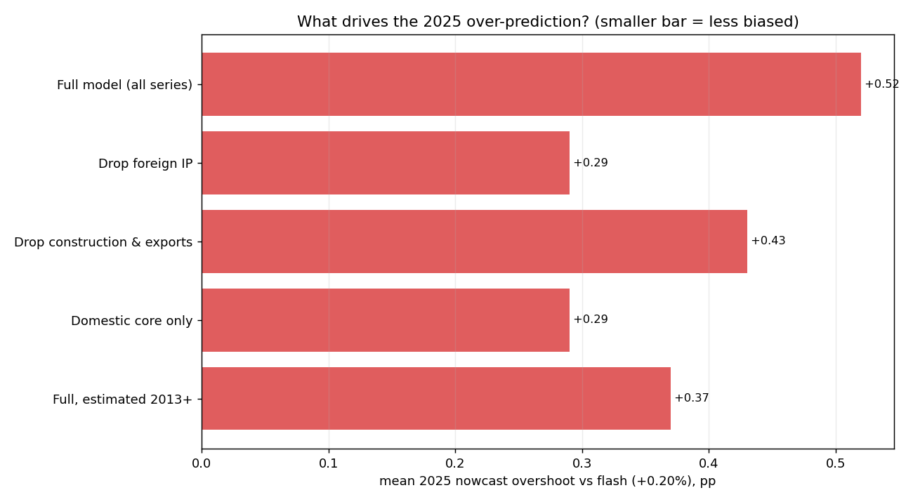

# Why the model over-predicts 2025 GDP

The 2025 real-time nowcasts settled around +0.7 to +1.0% while the flashes were ~+0.2%. This is a
genuine upward bias. An ablation — nowcast all four 2025 quarters with GDP withheld, under model
variants — pins down the cause, and it **overturned the first guess**: the raw monthly data made
foreign IP look only mildly positive, but in the factor model it turns out to be the single
biggest driver of the overshoot.

## 1. The largest single driver: the foreign (German/EA) industrial block

Dropping **foreign IP** (German + euro-area industrial production, German autos) cuts the mean
2025 overshoot from **+0.52pp** to **+0.29pp** — the biggest improvement of any
variant. The mechanism: Slovakia is a supplier to the German industrial chain, so the DFM gives
the foreign block heavy weight on the common factor. In 2025 German/EA industry held up (German
auto output averaged +0.4% MoM) **while Slovak domestic demand decoupled and fell** (domestic
production −0.7%, retail −0.3%). The model kept inferring strength from abroad that didn't
materialise at home. This is exactly the effect you suspected.

## 2. Also material: a regime shift in trend growth

Slovak quarterly GDP growth **halved** — mean **+0.96%** in 2002-2019 vs
**+0.40%** in 2021-2025. Estimated on the whole sample, the model is anchored near the
old, higher mean (this is the +1.5% cold-start). Re-estimating on **2013+ data** lowers the
overshoot to **+0.37pp** — a second, independent chunk of the bias.

## 3. Smaller: construction & exports

Construction (+0.7 MoM) and exports (+0.4) also stayed positive in 2025; dropping them lowers the
overshoot to **+0.43pp** — real but the smallest of the three effects.

## Ablation results (mean 2025 nowcast vs flash +0.20%)

| Variant | 2025Q1 | 2025Q2 | 2025Q3 | 2025Q4 | mean | overshoot |
|---|---|---|---|---|---|---|
| Full model (all series) | 0.91 | 0.64 | 0.38 | 0.95 | 0.72 | 0.52 |
| Drop foreign IP | 0.42 | 0.41 | 0.61 | 0.51 | 0.49 | 0.29 |
| Drop construction & exports | 0.57 | 0.66 | 0.59 | 0.7 | 0.63 | 0.43 |
| Domestic core only | 0.21 | 0.68 | 0.38 | 0.68 | 0.49 | 0.29 |
| Full, estimated 2013+ | 0.7 | 0.52 | 0.22 | 0.85 | 0.57 | 0.37 |

## Takeaways / how to fix it

1. **Re-weight or discipline the foreign block** — the highest-value fix. The German/EA IP block
   is a strong *leading* signal but in 2025 it decoupled from Slovak domestic demand. Options: put
   foreign IP in its own factor block (so it can't dominate the domestic cycle), down-weight it, or
   add domestic demand series (real wages, VAT/consumption) to balance it.
2. **Address the regime shift too** — a shorter/rolling estimation window or a time-varying
   trend/local-level component removes the pre-2020 growth anchor (2013+ already helps).
3. Together these are additive: the foreign block and the regime anchor are largely independent
   sources of the ~0.5pp level bias, so fixing both should bring 2025 nowcasts close to the flashes.
4. This reframes the earlier RMSE: much of the 2025 error is a *level* bias (foreign decoupling +
   stale mean), not noise — a structural fix, not just more data, is what's needed.

*Generated by `src/bias_investigation.py`.*
