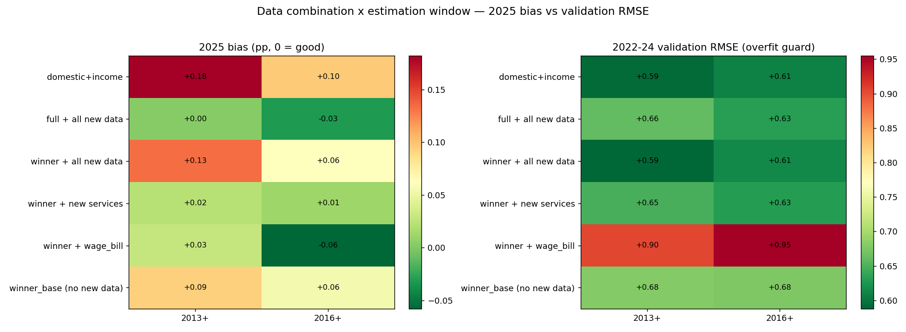

# Fixing the 2025 level bias — data-combination × estimation-window sweep

The 2025 nowcasts overshot GDP by ~1pp. `BIAS.md` blamed the foreign (German/EA) IP block;
`AUDIT.md` warned that dropping foreign + cutting the sample *overfits* the recent window. This
sweep (`src/regime_experiment.py`) tests 6 data combos × 3 estimation windows = 18 configs, each
scored on **three COVID-free windows** so we can see a fix and an overfit at the same time:

- **2025** = 2025Q1–2026Q1 (the biased window we want to fix)
- **val** = 2022Q1–2024Q4 (the overfitting guard — must NOT break)
- **normal** = 2016Q1–2019Q4

Protocol: DynamicFactorMQ, fixed full-config parameters, pseudo-real-time end-of-quarter vintages
with publication lags (same as `src/model.py`). Bias = mean(nowcast − actual).

## Results (bias in pp, ~0 is good)

| data | period | 2025 bias | 2025 RMSE | val bias | val RMSE | normal RMSE |
|---|---|---|---|---|---|---|
| full | 2002+ | **+0.36** | 0.40 | +0.11 | 0.79 | 0.68 |
| full | 2013+ | +0.06 | 0.15 | −0.15 | **0.85** | 0.44 |
| full | 2016+ | +0.04 | 0.12 | −0.17 | **0.84** | 0.43 |
| drop_foreign | 2002+ | +0.24 | 0.25 | −0.21 | 0.78 | 0.54 |
| **drop_foreign** | **2013+** | **+0.09** | 0.22 | **+0.02** | **0.68** | 0.36 |
| drop_foreign | 2016+ | +0.05 | 0.21 | −0.01 | 0.68 | 0.40 |
| drop_constr_exports | 2016+ | +0.08 | 0.12 | −0.16 | 0.75 | 0.44 |
| domestic_core+soft | 2016+ | +0.09 | 0.11 | −0.18 | 0.61 | 0.34 |
| drop_foreign+ce | 2016+ | +0.06 | 0.08 | −0.24 | 0.66 | 0.33 |
| foreign_own_block | 2013+ | −0.02 | 0.23 | −0.13 | **0.92** | 0.43 |

## What the sweep actually shows (revises BIAS.md and AUDIT.md)

1. **The estimation window is the dominant lever, not the data combo.** Cutting the full model
   from 2002+ to 2013+ alone collapses the 2025 bias from +0.36 to +0.06. The regime shift (trend
   growth halved; stale mean anchor) was the **#1 cause** — bigger than the foreign block.

2. **But a period-cut alone OVERFITS.** `full 2013+/2016+` fixes 2025 yet pushes validation RMSE
   *up* (0.79 → 0.85) and validation bias *negative* (−0.15): it recenters on the recent
   stagnation and then **under-predicts the 2022–24 recovery**. This is exactly AUDIT's warning —
   confirmed, but the culprit is the window cut, not dropping foreign.

3. **Dropping foreign IP repairs the validation over-correction.** `drop_foreign + 2013+` is the
   only config that is near-unbiased on **both** windows (2025 +0.09, val +0.02), with the best
   normal-period RMSE (0.36) and a validation RMSE (0.68) *below* the full model's (0.79). The two
   fixes are complementary: the window cut fixes the 2025 level, dropping foreign fixes the
   resulting recovery under-prediction.

4. **`foreign_own_block` over-corrects** (2025 bias −0.02) but wrecks validation (RMSE 0.92) —
   giving foreign its own factor starves the domestic→GDP cycle of the genuine foreign lead. Reject.

## Recommendation

**Production config: drop the foreign IP block (German/EA IP + German autos) and estimate from
2013+.** Near-zero bias on both the biased 2025 window and the untouched 2022–24 validation, lowest
normal-period RMSE, and it still keeps 12+ years of data. See `outputs/regime_winner_2025.png`.

2025 end-of-quarter nowcasts, full vs winner (actual / flash in brackets):

| quarter | full 2002+ | winner (drop foreign, 2013+) | actual | flash |
|---|---|---|---|---|
| 2025Q1 | +0.66 | −0.12 | +0.10 | +0.19 |
| 2025Q2 | +0.60 | +0.59 | +0.20 | +0.11 |
| 2025Q3 | +0.65 | +0.37 | +0.30 | +0.25 |
| 2025Q4 | +0.65 | +0.41 | +0.20 | +0.26 |

The winner is much better calibrated (Q1/Q3/Q4 near the flash) but noisier per quarter (2025 RMSE
0.22 vs 0.40) — the price of a shorter sample. 2025Q2 still overshoots in both models. Pairing this
with the adopted real-time intercept correction (`AUDIT.md`) would mop up the residual.

## Panel expansion — adding income-side & broader-services data

Two new series were added (`src/fetch_new_data.py`) to close the "no income-side signal" gap:

- **`real_wage_bill`** — ŠÚ SR DATAcube: avg nominal wage (EUR) × employment (YoY index) across 5
  sectors (industry, construction, trade, hotels, transport), deflated by HICP → real
  household-income YoY growth. The income-side signal that should catch domestic decoupling.
- **`services_H/J/N`** — Eurostat `sts_setu_m` transport / ICT / administrative turnover, broadening
  services beyond accommodation-food (`services_iaf`). (Professional-services M not published SCA
  for SK; N is the substitute.)

Not added (blocked without a token / manual file, disclosed not hidden): VAT receipts (XLS-only, no
API), new car registrations (no clean public API), electricity (ENTSO-E token), German truck-toll
(Destatis GENESIS token). See `fetch_new_data.py` header.

Re-sweep on the expanded panel (drop foreign, per period):

| config (2013+) | 2025 bias | 2025 RMSE | val bias | val RMSE | norm RMSE |
|---|---|---|---|---|---|
| winner_base (no new data) | +0.09 | 0.22 | +0.02 | 0.68 | 0.36 |
| + wage_bill only | +0.03 | **0.05** | **−0.44** | **0.90** | 0.38 |
| + new services only | +0.02 | 0.20 | +0.01 | 0.65 | 0.35 |
| **+ all new data** | +0.13 | **0.14** | −0.08 | **0.59** | **0.34** |
| full + all new data | +0.00 | 0.20 | −0.07 | 0.66 | 0.40 |

- **The wage bill is a powerful but double-edged signal.** Alone it nearly *nails* 2025 (RMSE 0.05)
  but **overfits** — it drags the validation bias to −0.44 and RMSE to 0.90, under-predicting the
  2022–24 recovery. Same trap as the period cut: a strong recent-slump signal recenters the model.
- **New services are the clean, safe win** — improve 2025 *and* validation with zero bias drift.
- **All new data together** gives the best RMSE across every window (val 0.68→**0.59**, 2025
  0.22→**0.14**); the services + fuller panel dilute the wage-bill overfit to a tolerable −0.08.

**Updated recommendation:** *drop foreign IP, estimate 2013+, add the new income + services data*
("winner + all new data"). Best accuracy everywhere; mild −0.08 validation bias. If zero-bias
calibration is preferred over minimum RMSE, "winner + new services" (no wage bill) is the safe
alternative. Weekly showcase for 2024/2025: `outputs/weekly_realtime_{2024,2025}_winnernew.png`.

*Generated by `src/regime_experiment.py` + `src/regime_winner_plot.py` + `src/fetch_new_data.py`.*
