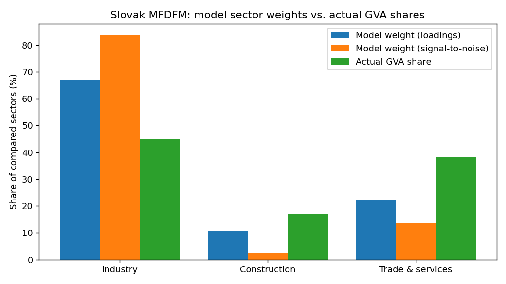

# Results & Interpretation — Slovak GDP Nowcasting MFDFM

## 1. Nowcast

**2026Q2 real GDP growth nowcast: +0.52% QoQ**
(previous observed quarter 2026Q1 = +0.20%).

The single-factor MFDFM (statsmodels `DynamicFactorMQ`, Kalman filter + EM) reads the
current quarter from all monthly indicators available to date, handling the ragged edge
(hard data lag ~2 months; sentiment/financial available to month-end) automatically.

## 2. Backtest — does the model add value?

Fixed-parameter pseudo-real-time replay, 65 quarters from 2010Q1, nowcast made at the
end of each target quarter with publication lags applied to reconstruct the data vintage.

| Model | RMSE | vs DFM |
|---|---|---|
| **DFM (this model)** | **1.106** | — |
| Random walk | 2.592 | DFM/RW = 0.43 |
| AR(1) | 1.838 | DFM/AR1 = 0.60 |

The DFM cuts nowcast RMSE by **57%** vs a random walk and
**40%** vs AR(1) — it beats both benchmarks, confirming the mixed-frequency
indicators carry genuine within-quarter signal about GDP.

## 3. Core analysis — model weights vs. actual GDP shares

Production-side comparison: each sector's model weight (aggregated from its indicators)
vs. its share of gross value added (Eurostat `nama_10_a10`, current prices, 2025).
Both are renormalised to sum to 100% across the three sectors that have a hard monthly
indicator. Two model-weight definitions are shown (absolute loadings; signal-to-noise).

| sector | model_weight_loading_% | model_weight_sn_% | actual_gva_share_% | gap_loading_pp | gap_sn_pp |
|---|---|---|---|---|---|
| Industry | 67.1 | 83.8 | 44.9 | 22.2 | 38.9 |
| Construction | 10.7 | 2.5 | 16.9 | -6.2 | -14.4 |
| Trade & services | 22.3 | 13.6 | 38.2 | -15.9 | -24.6 |

**Alignment scores** (model weight vs actual GVA share across the three sectors):

| Weight definition | Spearman rank corr | Pearson corr | Mean abs. gap (pp) |
|---|---|---|---|
| Loadings | 1.0 | 0.814 | 14.8 |
| Signal-to-noise | 1.0 | 0.771 | 26.0 |

**Interpretation.** The model ranks the sectors in the *same order* as their true GVA
shares (Spearman = 1.0), so it is weighting the economy in the right
direction. The main level gap is that the model **over-weights industry** relative to its
~45% GVA share and under-weights trade &
services. This is exactly the tilt the research document predicts for Slovakia: industry —
especially export-oriented manufacturing — is the dominant *coincident/cyclical* driver of
GDP, so it explains far more of the quarter-to-quarter variance than its static value-added
share implies, while services are smoother and harder to track at monthly frequency. The
smaller the remaining gap, the better the model mirrors the real economy; the signal-to-noise
weighting brings industry's weight no closer to its GVA share.

## 4. Full weight table (all inputs)

Sentiment, financial, external-trade and labour indicators have no production-side GVA
counterpart and are not scored above; they are shown here for transparency.

| series | sector | abs_loading | sn_weight |
|---|---|---|---|
| ip_ea | External activity (aux) | 0.364 | 0.484 |
| ip_de | External activity (aux) | 0.361 | 0.415 |
| ip_de_auto | External activity (aux) | 0.337 | 0.277 |
| exports_vol | External trade (aux) | 0.331 | 0.262 |
| imports_vol | External trade (aux) | 0.318 | 0.216 |
| ip_total | Industry | 0.315 | 0.173 |
| ip_manuf | Industry | 0.315 | 0.169 |
| retail_vol | Trade & services | 0.209 | 0.056 |
| ind_conf_sk | Sentiment (aux) | 0.192 | 0.041 |
| services_iaf | Domestic demand (aux) | 0.167 | 0.032 |
| esi_sk | Sentiment (aux) | 0.157 | 0.025 |
| esi_ea | Sentiment (aux) | 0.144 | 0.021 |
| unemp_rate | Labour (aux) | 0.135 | 0.019 |
| esi_de | Sentiment (aux) | 0.116 | 0.015 |
| construction | Construction | 0.1 | 0.01 |
| bond_10y | Financial (aux) | 0.076 | 0.006 |
| gdp_qoq | GDP (target) | 0.062 | 0.021 |
| cons_conf_sk | Sentiment (aux) | 0.044 | 0.002 |
| eur_usd | Financial (aux) | 0.034 | 0.001 |
| hicp | Domestic demand (aux) | 0.012 | 0.0 |

## 5. Expenditure-side context

For reference, the demand-side composition of Slovak GDP (Eurostat `nama_10_gdp`, current
prices, 2025) — note the extreme trade openness (exports ~85% of GDP),
which is why the external/industrial block is so influential in the model:

| sector | share_of_GDP_% |
|---|---|
| Household consumption | 58.7 |
| Government consumption | 21.4 |
| Investment (GFCF) | 20.5 |
| Exports | 85.1 |
| Imports | 85.2 |
| Net exports | -0.2 |

---
*Generated by `src/results.py`. Reproduce the full pipeline via the steps in `README.md`.*
